# Calmaria Spa

**Calmaria Spa** é uma aplicação frontend desenvolvida em **React** com **Styled Components**, criada para transmitir leveza, bem-estar e uma navegação suave. O projeto apresenta serviços, conteúdos e sessões visuais organizadas de forma responsiva e modular.

---

## Demonstração  

### Tela Inicial  
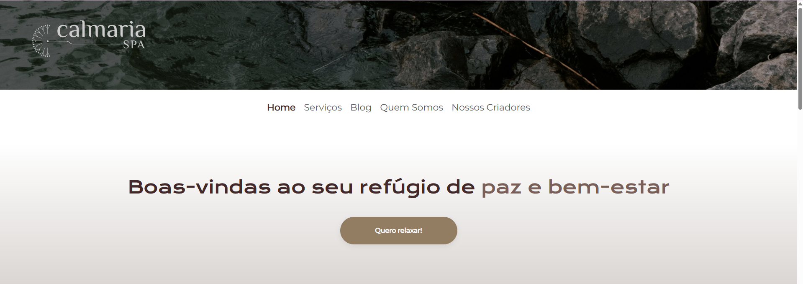
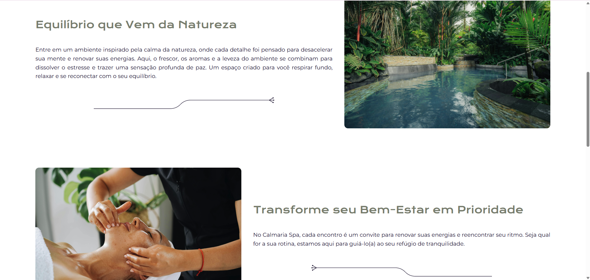
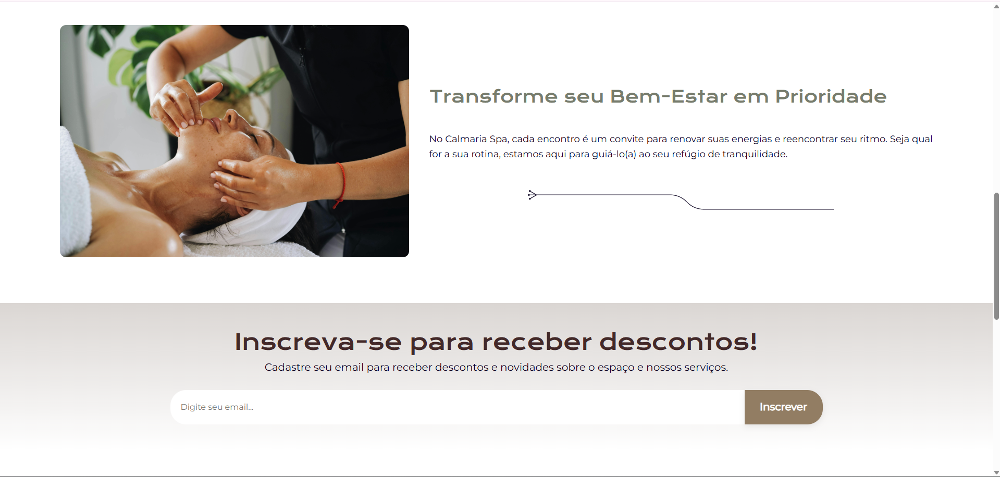
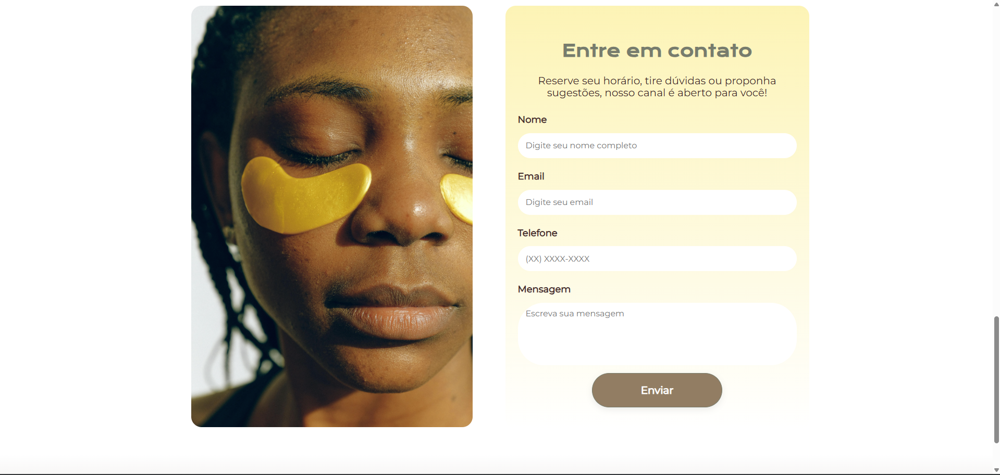
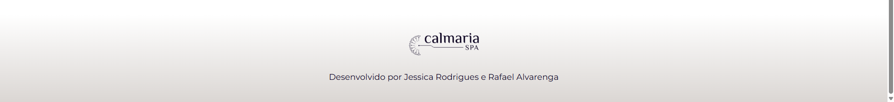

### Página de Serviços  
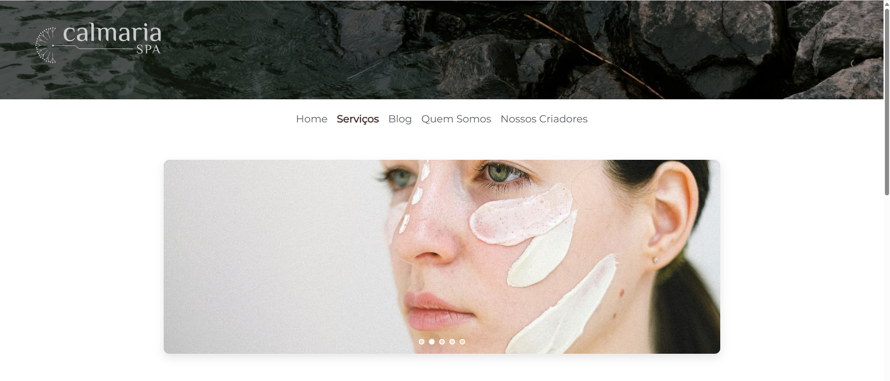
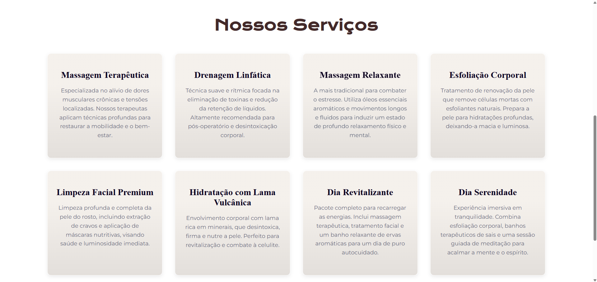


### Demonstração do Blog  
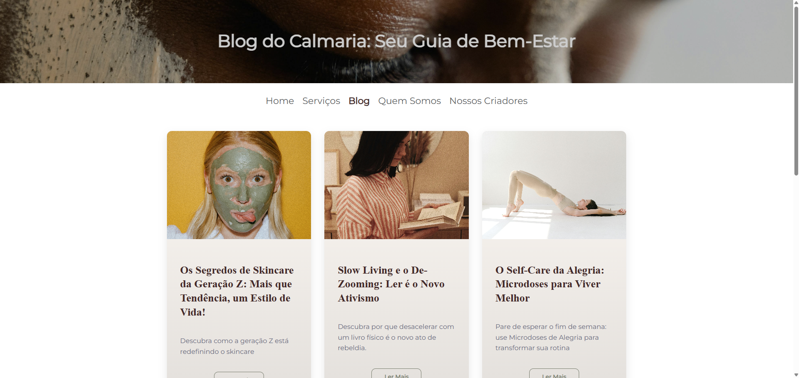
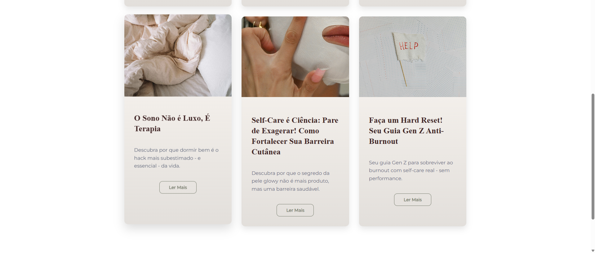


### Demonstração de um Post do Blog  
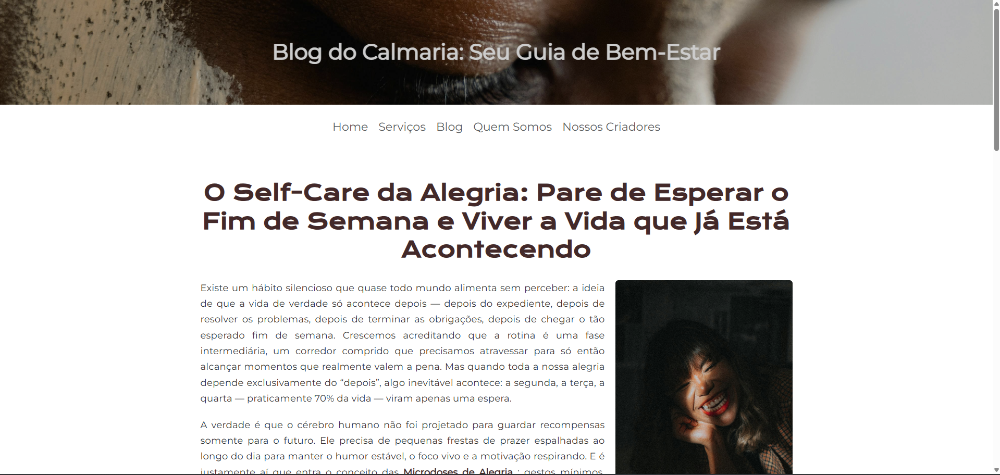
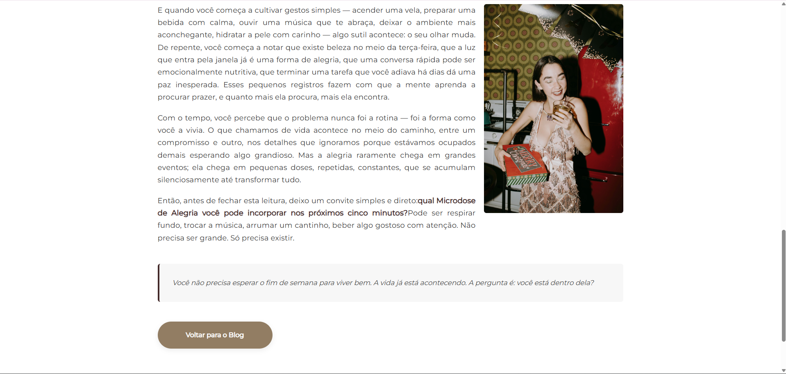


### Página "Sobre o Spa"  
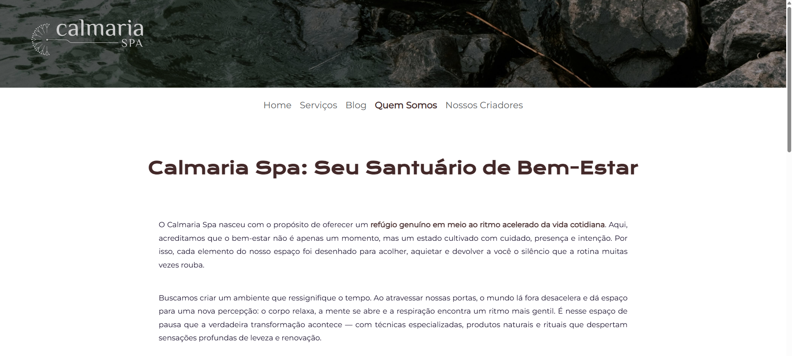
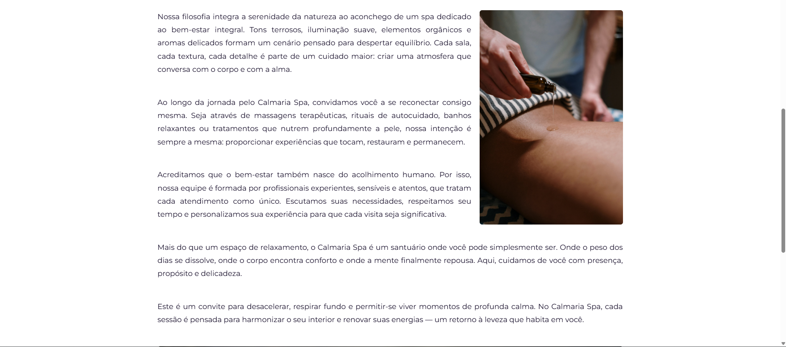

### Página "Sobre os Criadores"  
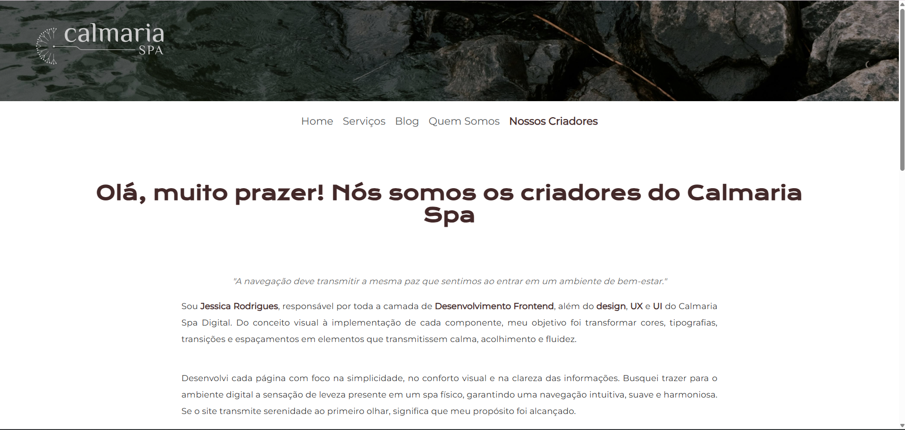
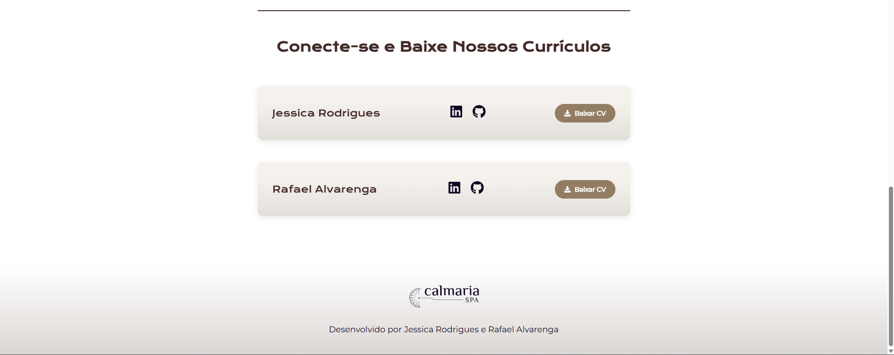


---

## Tecnologias Utilizadas
- **React**
- **Vite**
- **Styled Components**
- **React Icons**
- **Swiper.js** (sliders)
- **ESLint**
- **JavaScript (ES6+)**

---

##  Estrutura do Projeto

```
calmaria-spa/
├── public/
│ └── favicon.svg
├── src/
│ ├── assets/ # Imagens utilizadas no projeto
│ ├── components/ # Componentes reutilizáveis
│ │ ├── Buttons/
│ │ ├── Cards/
│ │ ├── Footer/
│ │ ├── Header/
│ │ ├── ImageSlider/
│ │ ├── NavBar/
│ │ └── ...
│ ├── data/ # Dados para serviços, sliders, textos etc.
│ ├── pages/ # Páginas principais (Home, Services, Blog...)
│ ├── styles/ # Tema global, breakpoints e reset CSS
│ ├── App.jsx # Estrutura principal da aplicação
│ └── main.jsx # Ponto de entrada
└── package.json
```

---

##  Principais Funcionalidades

### **Layout totalmente responsivo**  
Breakpoints configurados manualmente para múltiplas larguras de tela.

### **Componentização limpa**  
Componentes separados por responsabilidade (Cards, Slider, NavBar, Footer etc).

### **Styled Components com tema global**  
- Cores, tipografia e espaçamentos centralizados.  
- Facilita manutenção e mudanças visuais.

### **Sliders com Swiper.js**  
Utilizados para banners e seções com múltiplas imagens.

### **Organização modular do conteúdo**  
Dados mantidos em `/src/data` para facilitar edição e escalabilidade.

---
##  Sobre o Design

O design do Calmaria Spa foi inspirado em um layout apresentado em um curso da Alura.
Usei o arquivo do Figma apenas como referência estética inicial, mas todo o restante — cores, tipografia, composição, espaçamentos, componentes e estrutura visual — foi modificado e recriado para refletir um estilo próprio.

A interface final segue uma proposta mais minimalista e acolhedora, com foco em:

- **Paleta suave em tons naturais**: tons neutros, verdes suaves e cores terrosas.
- **Harmonia entre texto e imagens** para reforçar a sensação de conforto.
- **Uso moderado de sombras, espaçamentos amplos e arejamento visual**.
- **Layout minimalista**, garantindo que o usuário navegue de forma fluida e tranquila.
- **Componentes visuais consistentes** com o tema (botões, cards, seções e banners).
- **Sliders com transições suaves**, reforçando o clima relaxante.
- **Responsividade cuidadosa** para manter estética e experiência em qualquer tela.

O objetivo foi unir estética limpa com uma experiência que remete ao bem-estar — o mesmo que se espera ao entrar em um spa físico.

Figma utilizado como inspiração para realização do projeto: [Protótipo Figma] (https://www.figma.com/proto/OCTufveMJNvpfVZg0AwAEe/Calmaria-Spa-%7C-Curso-Sass?node-id=98-572&t=6CQJlQDEUQ3aSOd5-1)
---

## ▶ Como Rodar o Projeto

```bash
# Instalar dependências
npm install

# Rodar localmente
npm run dev
